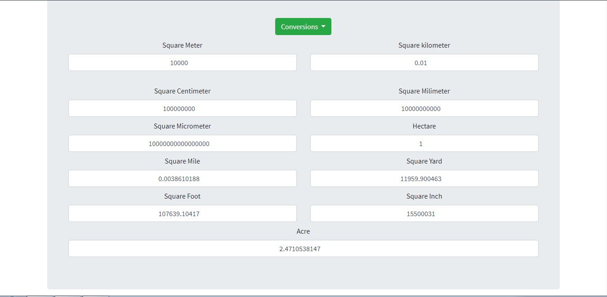
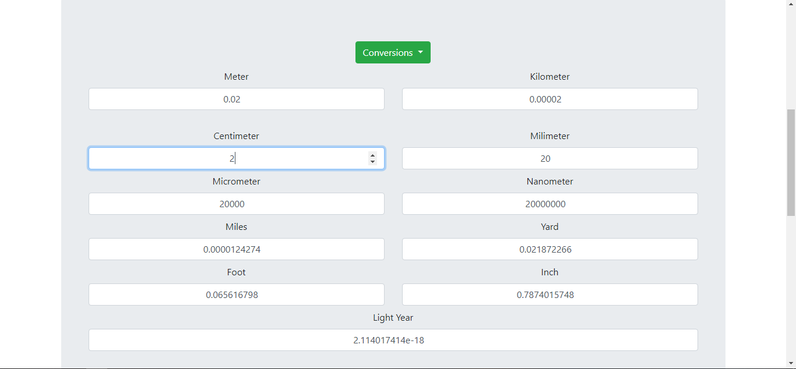
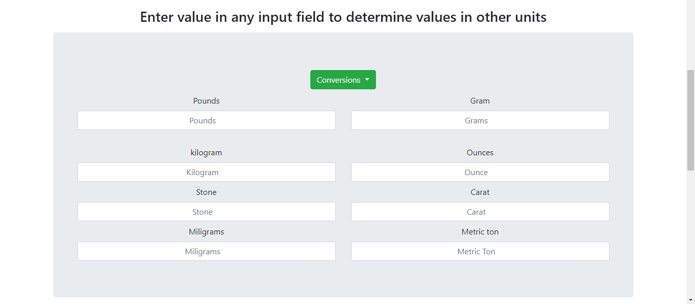
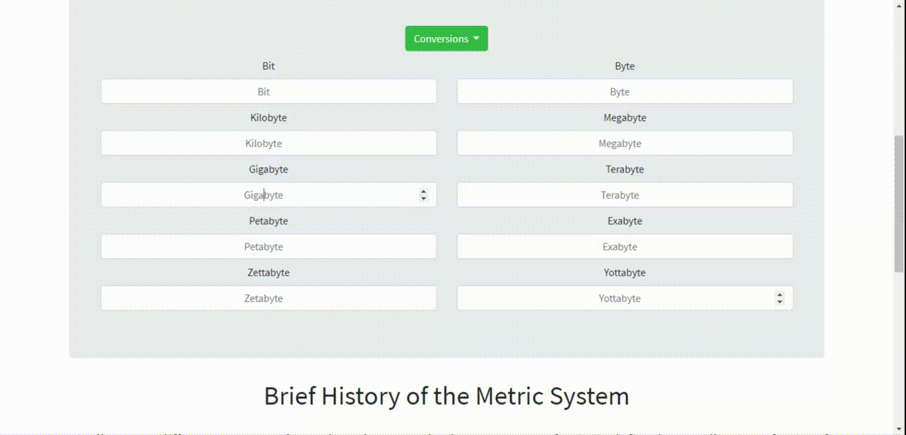

# Conversion Calculator
**This lets you convert any measurement units into the other units dynamically!. Just enter value in any input field and it automatically show's value in other units field without even any clicks.**

### It has 6 sections:
* Digital
    * Number System conversions
    * Digital Storage
* Physics
    * Area
    * length
    * speed
    * temperature
    * weight
* Chemistry

* Geometry
    * Circle
    * Square
    * Rectangle
* Finance

* Time

*Let me know, if I can add some more conversion units* :slightly_smiling_face:
 
Here are some screenshots
- Area Screenshot

- Length Screenshot

- Weight screenshot 

- storage screenshot

**How to use:**

### Built with
* [Bootstrap](https://getbootstrap.com/) - For Reponsive UI
* [Font Awesome](https://fontawesome.com/) - For icons

### License
[GNU General Public License v3.0](LICENSE)
