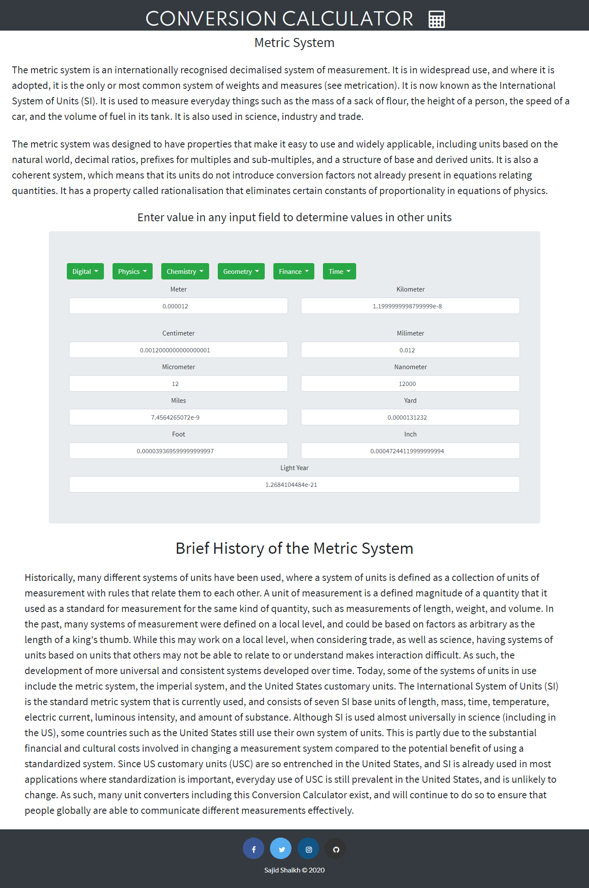

# Conversion Calculator
**This lets you convert any measurement units into the other units dynamically!. Just enter value in any input field and it automatically show's value in other units field without even any clicks.**

### Currently it can convert
- Area
- Weight
- Length
- Temperature
- Speed
- Number System Conversion
- Digital Storage

**Let me know, if I can add some more conversion units** :slightly_smiling_face:
 
Here are some screenshots

### Built with
* [Bootstrap](https://getbootstrap.com/) - For Reponsive UI
* [Font Awesome](https://fontawesome.com/) - For icons

### License
[GNU General Public License v3.0](LICENSE)
