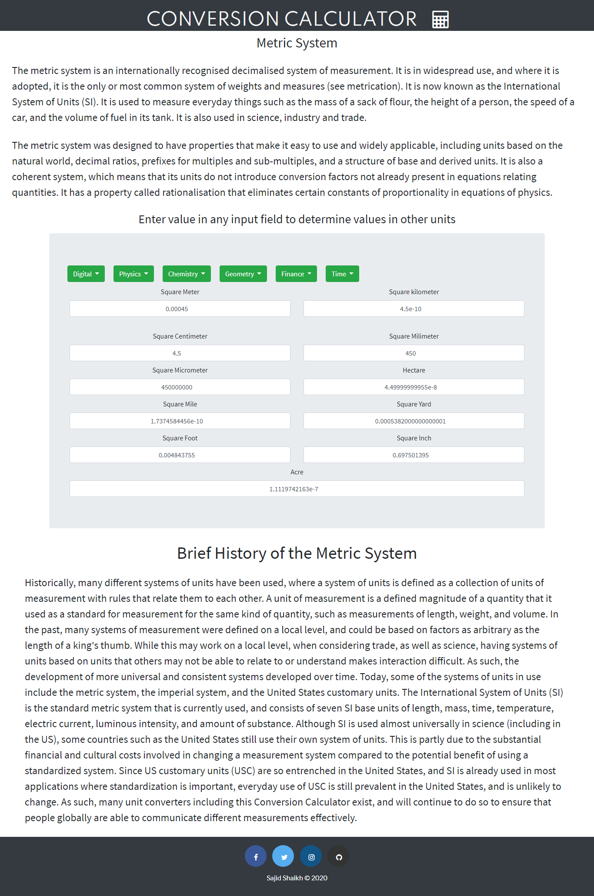
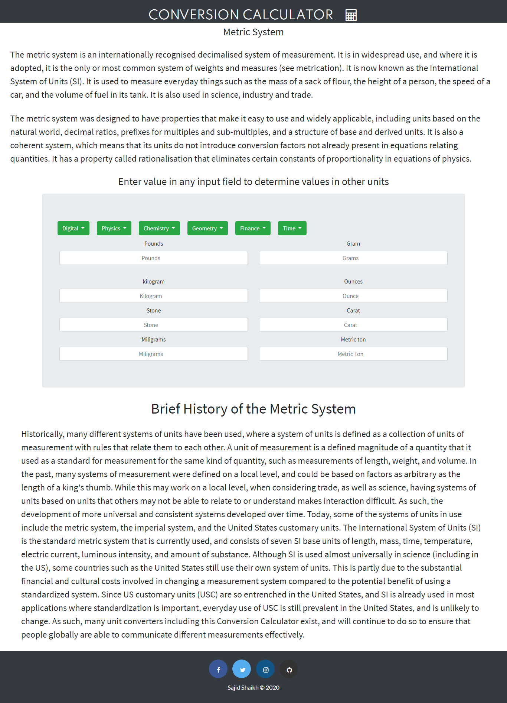

This webpage is written in HTML,CSS and JavaScript. This lets you convert any measurement units into the other units. Just enter value in any input field and it automatically show's value in other units field without even any clicks.

Currently it can covert
1)Area
2)Weight
3)Length
4)Temperature
5)Speed

Let me know, if I can add some more conversion units :)

Here are some screenshots

